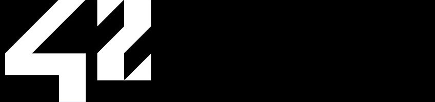

# 42

`DON'T COPY, LEARN`

## 📋 Table of contents
- [42](#42)
	- [📋 Table of contents](#-table-of-contents)
	- [🤔 What is 42?](#-what-is-42)
		- [🏊🏻 The Piscine](#-the-piscine)
		- [🧑🏻‍💻 The Cursus](#-the-cursus)
	- [💬 Availability](#-availability)
	- [🧑🏻 Intra information](#-intra-information)
	- [🪛 Utils](#-utils)
	- [⚙️ Project information](#️-project-information)
	- [⚖️ License](#️-license)

## 🤔 What is 42?
42 is a tuition-free and open 24/7 computer programming school based on peer-to-peer learning, without teachers, lectures and schedules, entirely *up-to-you* and project-based.

### 🏊🏻 The Piscine
The access method is known as the *Piscine*, in where candidates start writing their first lines of code in order to learn the basics of Shell, C and programming logic.

<!-- This repository contains my solutions to the problems found throughout the *Piscine* taken from 1st to 26th of July in Madrid ([learn more here](https://www.42madrid.com/)). -->

### 🧑🏻‍💻 The Cursus
*More information soon.*

## 💬 Availability
Documentation is available in the following languages:
- Spanish
- English

See [docs](docs) for more details.

## 🧑🏻 Intra information

## 🪛 Utils
A useful [Libft](src/42%20Cursus/Libft/) testing tool.

Automatic test cases for the [C Piscine](src/C%20Piscine/) exercises.

>[!IMPORTANT]
Once cloned, install it's requirements with `pip install -r requirements.txt`. After that, head to `tester.sh` and do the following:
>-	Comment the line starting with `source`.
>-	Change `python` to `python3`.

## ⚙️ Project information

## ⚖️ License

**This project is distributed under the terms of the MIT License.** This means you can use, modify, and distribute this code freely. For more details, read [LICENSE](LICENSE) or head to https://opensource.org/licenses/MIT.
