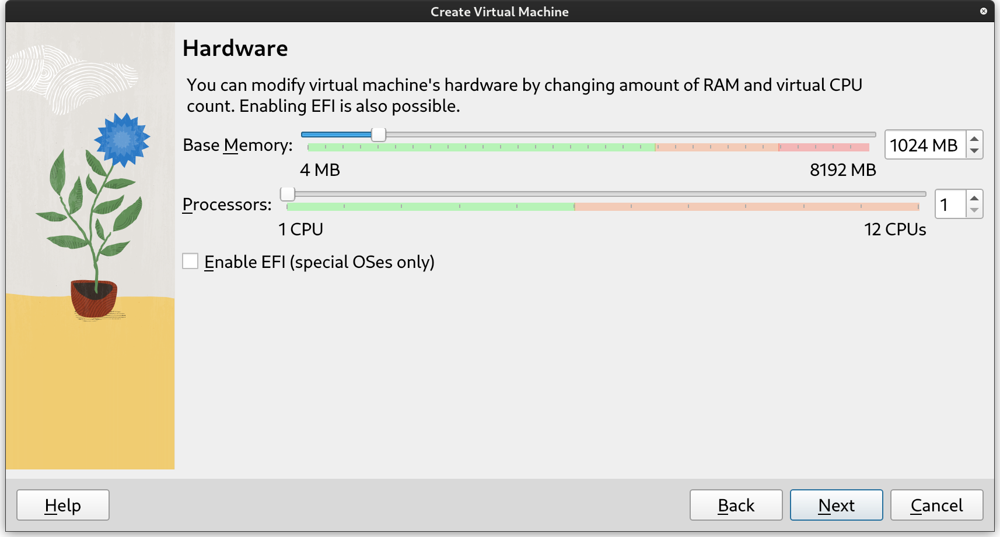
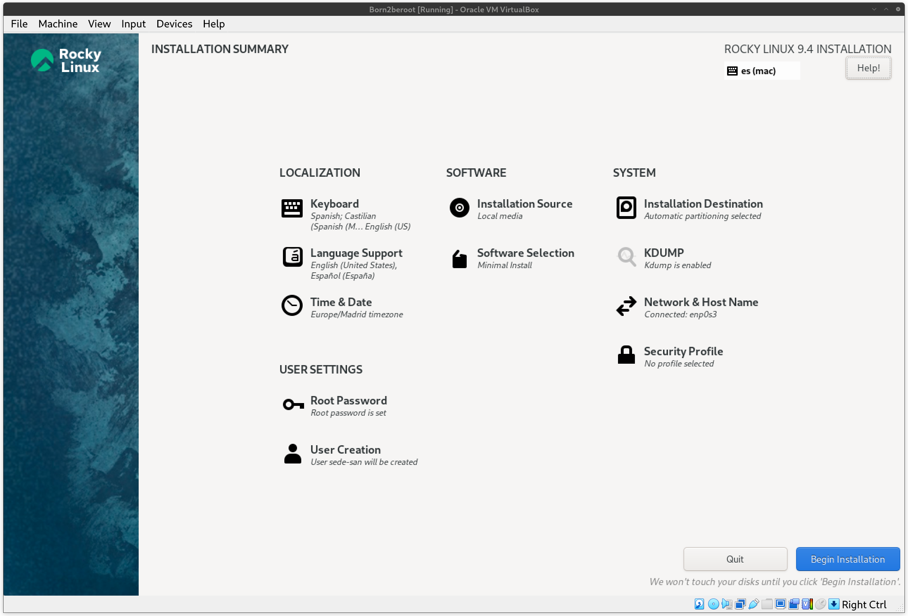

# Born2beroot

## 📋 Tabla de contenidos
- [Born2beroot](#born2beroot)
	- [📋 Tabla de contenidos](#-tabla-de-contenidos)
	- [👨🏻‍💻 Hipervisor](#-hipervisor)
	- [💿 Sistema operativo](#-sistema-operativo)
	- [💻 Configuración de la máquina](#-configuración-de-la-máquina)
	- [📥 Instalación](#-instalación)
		- [🌍 Localización](#-localización)
		- [🧑🏻 Ajustes de usuario](#-ajustes-de-usuario)
		- [📦 Software](#-software)
		- [💾 Sistema](#-sistema)
	- [💯 Parte obligatoria](#-parte-obligatoria)
		- [Gestor de paquetes](#gestor-de-paquetes)
		- [SELinux (Security-Enhanced Linux)](#selinux-security-enhanced-linux)
			- [Configuración](#configuración)
		- [LVM (Logical Volume Manager)](#lvm-logical-volume-manager)
			- [Configuración](#configuración-1)
		- [SSH (Secure Shell)](#ssh-secure-shell)
			- [Configuración](#configuración-2)
		- [Firewalld](#firewalld)
			- [Configuración](#configuración-3)
		- [Hostname](#hostname)
			- [Configuración](#configuración-4)
		- [Política de contraseñas](#política-de-contraseñas)
			- [Configuración](#configuración-5)
		- [Sudo](#sudo)
			- [Configuración](#configuración-6)
			- [Defensa](#defensa)
		- [Script](#script)
			- [Creación del script](#creación-del-script)
	- [🅱️ Parte bonus](#️-parte-bonus)

## 👨🏻‍💻 Hipervisor
[Oracle VM Virtualbox](https://www.virtualbox.org/)

## 💿 Sistema operativo
Se ha decidido realizar este proyecto con [Rocky Linux v9.4](https://rockylinux.org/) utilizando la `minimal.iso` como imagen del sistema operativo.

## 💻 Configuración de la máquina
Se recomienda configurar 2GB (2048 MB) de RAM y 2 CPUs como mínimo.

El disco se reserva de manera dinámica.

## 📥 Instalación
Los ajustes de localización se dejarán a gusto del estudiante, sin embargo, el resto de ajustes, se deben dejar como se muestra en la imagen, siendo el nombre del usuario el login del estudiante.

### 🌍 Localización
Estos ajustes se dejarán a gusto del estudiante.

### 🧑🏻 Ajustes de usuario
Deberemos configurar el usuario root y otro con el login como nombre.

### 📦 Software
Mantendremos la configuración por defecto.

### 💾 Sistema
Deberemos seleccionar el disco que hayamos configurado previamente como disco por defecto.

## 💯 Parte obligatoria

### Gestor de paquetes
Rocky Linux utiliza dnf como gestor de paquetes.

### SELinux (Security-Enhanced Linux)
SELinux es un sistema de control de acceso obligatorio integrado en el núcleo de Linux. Este añade una capa adicional de control que define qué operaciones pueden realizar cada usuario, proceso o aplicación en el sistema, independientemente de los permisos tradicionales. Para ello, utiliza políticas predefinidas o personalizadas que describen cómo deben comportarse las aplicaciones y los usuarios, definiendo qué procesos pueden acceder a qué recursos del sistema, esto lo realiza aplicando una etiqueta, o contexto, de seguridad que es evaluada antes de permitir el acceso.

Puede funcionar en tres distintos modos:
-	Enforcing (Aplicación). Aplica estrictamente las políticas de seguridad, bloqueando cualquier acceso no permitido.
-	Permissive (Permisivo). Registra pero no bloquea las violaciones de las políticas.
-	Disabled (Deshabilitado). Como bien indica el nombre, SELinux no realiza ninguna acción de seguridad en este modo.

En resumen, SELinux otorga una mayor seguridad frente a las amenazas con respecto a las ACL comunes, pues cada proceso y usuario, aún con permisos, puede o no realizar cambios dependiendo de las etiquetas que tenga definidas, limitando los daños que un ataque pueda provocar al sistema.

#### Configuración
Para configurar SELinux, deberemos acceder al archivo `/etc/sysconfig/selinux`. Una vez dentro, nos aseguraremos de que los siguientes parámetros aparecen como se muestra a continuación:
-	SELINUX=enforcing
-	SELINUXTYPE=targeting

> [!NOTE]
> Se recomienda configurar el modo de funcionamiento en *permissive* durante la configuración inicial, ya que el sistema puede tener recursos mal iniciados que no permitan el proceso de arranque.

Para confirmar los cambios, será necesario guardar el archivo y reiniciar el sistema. Una vez este arranque de nuevo, ya tendremos nuestra política de seguridad activa.

> [!TIP]
> Puedes consultar la política que se está ejecutando en todo momento con el comando `getenforce`.

Fuente: [https://www.redhat.com/es/topics/linux/what-is-selinux]()

### LVM (Logical Volume Manager)
El almacenamiento tradicional se basa en el espacio individual de cada disco. LVM, sin embargo, administra el espacio combinando la capacidad de los discos disponibles. De esta manera, LVM considera el almacenamiento de todos los discos como una capacidad total. Esto se consigue designando los discos de almacenamieno como *Volúmenes Físicos (PV)*, o capacidad que puede usar LVM. A continuación, estos PVs son añadidos a uno o más *Grupos de Volúmenes (VG)*. Por último, estos VGs son añadidos a uno o más *Volúmenes Lógicos (LV)*, los cuales son tratados como particiones tradicionales.

Fuente: [https://www.redhat.com/sysadmin/lvm-vs-partitioning]()

#### Configuración

### SSH (Secure Shell)
#### Configuración

### Firewalld
#### Configuración

### Hostname
El hostname es el nombre por el que se conoce un equipo dentro de una red. Esto se utiliza con el fin de identificar más fácilmente un equipo dentro de una red.

#### Configuración
Tenemos dos maneras de poder cambiar el nombre del equipo:
-	Modificando el fichero `/etc/hostname`
-	Usando el comando `hostnamectl set-hostname nombre` *(en el caso de Born2beroot, el hostname deberá ser el login del estudiante seguido de 42 (ej.: sede-san42))*

Si queremos modificar el hostname "bonito", deberemos ejeutar el comando `hostnamectl set-hostname --pretty nombre` (si el nombre es el mismo que el hostname, esto no tendrá efecto alguno).

Será necesario reiniciar el equipo para poder ver los cambios. Podemos hacer esto con el comando `reboot`.

Fuente: [https://www.geeksforgeeks.org/hostnamectl-command-in-linux-with-examples/]()

### Política de contraseñas

#### Configuración
-	Tu contraseña debe expirar cada 30 días.
	-	`/etc/login.defs` => PASS_MAX_DAYS 30 *(este ajuste solo aplica para los nuevos usuarios)*
	-	Para usuarios ya existentes, se deberá utilizar el comando `chage -M 30 usuario`
-	El número mínimo de días permitido antes de modificar una contraseña deberá ser 2.
	-	`/etc/login.defs` => PASS_MIN_DAYS 2 *(este ajuste solo aplica para los nuevos usuarios)*
	-	Para usuarios ya existentes, se deberá utilizar el comando `chage -m 2 usuario`
-	El usuario debe recibir un mensaje de aviso 7 días antes de que su contraseña expire.
	-	`/etc/login.defs` => PASS_WARN_AGE 7 *(este ajuste solo aplica para los nuevos usuarios)*
	-	Para usuarios ya existentes, se deberá utilizar el comando `chage -W 30 usuario`
-	Tu contraseña debe tener como mínimo 10 caracteres de longitud. Debe contener una mayúscula, una minúscula y un número. Por cierto, no puede tener más de 3 veces consecutivas el mismo carácter.
	-	`/etc/security/pwquality.conf`:11 => minlen = 10
	-	`/etc/security/pwquality.conf`:20 => ucredit = -1
	-	`/etc/security/pwquality.conf`:25 => lcredit = -1
	-	`/etc/security/pwquality.conf`:15 => dcredit = -1
	-	`/etc/security/pwquality.conf`:38 => maxrepeat = 3
-	La contraseña no puede contener el nombre del usuario.
	-	`/etc/security/pwquality.conf`:55 => usercheck = 1
-	La contraseña debe tener al menos 7 caracteres que no sean parte de la antigua contraseña. *Esta regla no se aplica para root*.
	-	`etc/security/pwquality.conf`:6 => difok = 7
-	Evidentemente, tu contraseña para root debe seguir esta política.
	-	`etc/security/pwquality.conf`:74 => enforce_for_root

En resumen, el archivo `pwquality.conf` contiene una gran cantidad de opciones para fortalecer las contraseñas de los usuarios de nuestro servidor. Born2beroot nos permite habilitar las reglas más utilizadas a la hora de reforzar la seguridad en las contraseñas.

Una vez cambiada la política de contraseñas, deberemos actualizar las contraseñas de todos los usuarios ya existentes con el comando `passwd usuario`. Si la configuración se ha aplicado correctamente, un intento de contraseña que no cumpla todas las nuevas reglas devolverá un error en la terminal.

Podremos consultar la caducidad de las contraseñas de un usuario concreto con el comando `chage -l usuario`.

Fuente: [https://www.server-world.info/en/note?os=Rocky_Linux_8&p=pam&f=1]()

### Sudo

#### Configuración
Toda la configuración referente al comando `sudo` se encuentra disponible en el fichero `/etc/sudoers`.

> [!WARNING]
> Aunque se nos recuerda en la cabecera del propio fichero, este deberá ser editado utilizando `visudo`. Este evita que varias personas editen el archivo de manera simultánea y verifica la sintaxis antes de guardar los cambios. Los cambios se realizan sobre un fichero temporal `/etc/sudoers.tmp` y, una vez se guarda, los cambios se aplican sobre el fichero real.

-	Autenticarte con sudo debe estar limitado a tres intentos en el caso de introducir una contraseña incorrecta.
	-	`/etc/sudoers` => Defaults passwd_tries=3
-	Un mensaje personalizado de tu elección debe mostrarse en caso de que la contraseña introducida sea incorrecta cuando se utilice sudo.
	-	`/etc/sudoers` => Defaults badpass_message="mensaje"
	-	Si queremos que, en vez de mostrar un mensaje personalizado, la máquina nos insulte, deberemos habilitar el siguiente ajuste (habilitando esta configuración, se ignora badpass_message): `/etc/sudoers` => Defaults insults
-	Para cada comando ejecutado con sudo, tanto el input como el output deben quedar archivados en el directorio /var/log/sudo/.
	-	`/etc/sudoers` => Defaults logfile="/var/log/sudo/sudo.log"
	-	`/etc/sudoers` => Defaults iolog_dir="/var/log/sudo"
	-	`/etc/sudoers` => Defaults log_input, log_output
> [!NOTE]
> Si el directorio no existe, deberemos crearlo nosotros a mano (`mkdir -p /var/log/sudo`).
-	El modo TTY debe estar activado por razones de seguridad.
	-	`/etc/sudoers` => Defaults requiretty
-	Por seguridad, los directorios utilizables por sudo deben estar restringidos. Por ejemplo: /usr/local/sbin:/usr/local/bin:/usr/sbin:/usr/bin:/sbin:/bin:/snap/bin
	-	`/etc/sudoers`:88 => Defaults secure_path = /usr/local/sbin:/usr/local/bin:/usr/sbin:/usr/bin:/sbin:/bin:/snap/bin

#### Defensa
Durante la defensa, se nos pedirá otorgar permisos de sudo a un nuevo usuario. Para ello, deberemos acceder nuevamente al archivo `/etc/sudoers` y añadir lo siguiente:

	usuario	ALL=(ALL)	ALL

Introduciendo esta línea estamos dando permiso al usuario para que en cualquier equipo pueda ejecutar cualquier comando.

En caso de tener un grupo de administradores (*sudo* en muchos sistemas Linux por defecto, o *wheel* en caso de Rocky), podemos añadir al usuario al grupo y ya tendría dichos permisos. Esto solo aplica si existe la siguiente regla:

	%grupo	ALL=(ALL)	ALL

> [!NOTE]
> En este caso, deberemos reiniciar la máquina una vez llevado a cabo este cambio.

Esto, al contrario que en el caso anterior, aplica los permisos de *sudo* sobre el grupo, y no sobre un usuario concreto.

Fuente: [https://www.geeksforgeeks.org/useful-sudoers-configurations-for-setting-sudo-in-linux/]()

### Script

#### Creación del script
El subject requiere que realicemos un script que, cada 10 minutos, muestre la siguiente información:
-	La arquitectura de tu sistema operativo y su versión de kernel.
-	El número de núcleos físicos.
-	El número de núcleos virtuales.
-	La memoria RAM disponible actualmente en tu servidor y su porcentaje de uso.
-	La memoria disponible actualmente en tu servidor y su utilización como un porcentaje.
-	El porcentaje actual de uso de tus núcleos.
-	La fecha y hora del último reinicio.
-	Si LVM está activo o no.
-	El número de conexiones activas.
-	El número de usuarios del servidor.
-	La dirección IPv4 de tu servidor y su MAC (Media Access Control)
-	El número de comandos ejecutados con sudo.

Para ello, crearemos el archivo `/root/monitoring.sh` y pondremos lo siguiente:

	#! /bin/bash

	arch=$(uname -p)
	kernel=$(uname -sr)
	physCPU=$(lscpu | awk 'FNR==12 {print $4}')
	virtCPU=$(lscpu | awk 'FNR==11 {print $4}')
	ramTot=$(awk '/MemTotal/ ${print $2}' /proc/meminfo)
	ramAva=$(awk '/MemAvailable/ ${print $2}' /proc/meminfo)
	ramUse=$(awk "BEGIN {print ${ramTot} - ${ramAva}}")
	diskTot=$(lsblk -b | awk '/sda/ {print $4}' | awk 'NR==1')
	diskAva=$(df --block-size=1 | awk 'FNR==5 {print $4}')
	diskUse=$(awk "BEGIN {print ${diskTot} - ${diskAva}}")

	echo -e "\t# Architecture:\t" ${arch}
	echo -e "\t# Kernel:\t" ${kernel}
	echo -e "\t# CPU Physical:\t" ${physCPU}
	echo -e "\t# vCPU:\t\t" ${virtCPU}
	echo -e "\t# Memory Usage:\t" $(awk "BEGIN {printf \"%.2f / %.2f MB (%.2f%%)\", ${ramUse} / 1024, ${ramUse} / 1024, ${ramUse} / ${ramTot} * 100}")

## 🅱️ Parte bonus